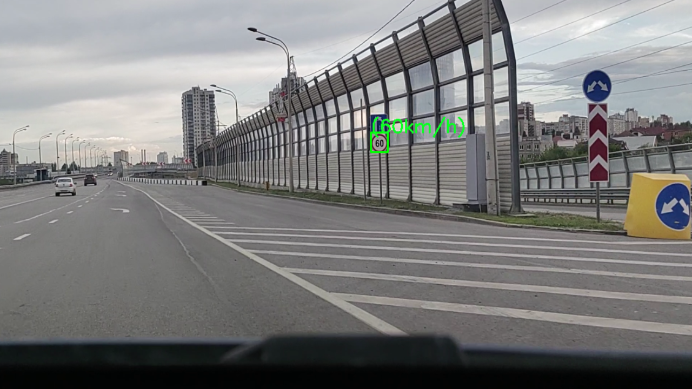
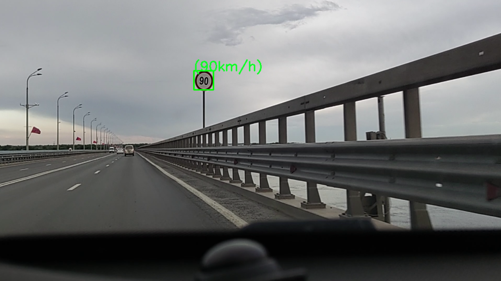

# *Распознавание дорожных знаков*
---
Код в этом репозитории предназначен для работы системы распознавания дорожных знаков.

## *Используемые библиотеки*

Для обучения классификатора использовались следующие библиотеки:

- TensorFlow
- Keras

## *Классификатор*
---
В качестве датасета для обучения классификатора был использован German Traffic Sign Recognition Benchmark (GTSRB).
Обучение проходило 40 эпох. Использовалось 13 слоёв, где слой свертки имеет от 16 до 512 фильтров. 
## *Детектор*
---
Для обучения детектора была использована модель YOLOv8. Модель обученная на весах yolov8x с использованием датасета Traffic Signs Dataset в формате YOLO.
Для обучения использовалось 25 эпох.
## *Точность*
---
Точность классификатора на метрике accuracy - 0.996
Точность детектора на метрике mAP50 - 0.982

## *Совместное использование детектора и классификатора*
---
Для совместного использования моделей классификатора и детектора необходимо использовать файл full_work.py;

Пример работы системы:

 

